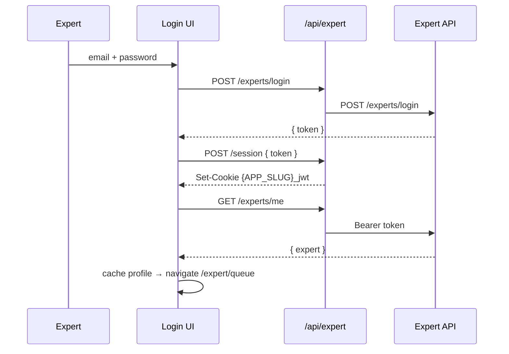
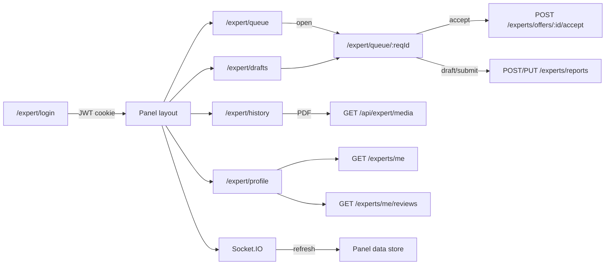

# Expert Webapp — Flows, Logic & API Reference

Shareable overview of **screens, business logic, and every API endpoint** used by the expert panel.

**Stack:** Vite + React + React Router · API proxy at `/api/expert/*` · Socket.IO for realtime.

**Backend base:** `API_BASE_URL` (server-only proxy target)

---

## 1. How the browser talks to the API

```
Browser  →  API_BASE_URL/<path>  (static dist)  or  /api/expert/<path>  (local proxy)
         →  API_BASE_URL/<path>
```

| Piece | Detail |
| --- | --- |
| Browser prefix | `/api/expert` |
| Auth | HttpOnly cookie `{APP_SLUG}_jwt` (default `expert_jwt`) |
| Proxy | Attaches `Authorization: Bearer <token>` (except login) |
| Response envelope | `{ error: boolean, message: string, data: T }` |

**Example:** browser `POST /api/expert/experts/login` → backend `POST /experts/login`.

---

## 2. App routes (screens)

| Route | Screen | Role |
| --- | --- | --- |
| `/` → `/sign-in` → `/expert/login` | Redirects | Entry |
| `/expert/login` | Login | Sign in; redirect to queue if already authenticated |
| `/expert/queue` | Queue | New offers + in-progress work, stats, skip/reassign |
| `/expert/queue/:reqId` | Request detail | Accept offer + evaluation form (draft / submit) |
| `/expert/drafts` | Drafts | Incomplete evaluations with progress |
| `/expert/history` | History | Past work, period filter, open report / PDF |
| `/expert/profile` | Profile | Profile + reviews (read-focused) |
| `/sign-up`, `/forgot-password`, `/check-email`, `/create-password`, `/verification-code` | Auth UI stubs | **Not wired** to expert API |
| `*` | Fallback | → `/expert/login` |

Panel pages (except login) use: **Auth guard → Profile + Panel data + Socket providers → Shell**.

---

## 3. API endpoint catalog

### 3.1 Local / edge routes (not Expert API REST)

| Method | Browser path | When used | Purpose |
| --- | --- | --- | --- |
| `GET` | `/api/expert/session` | Login gate, auth guard, session checks | `{ authenticated }` from cookie presence |
| `POST` | `/api/expert/session` | Right after login | Body `{ token }` → set HttpOnly JWT cookie (7 days) |
| `DELETE` | `/api/expert/session` | Logout / force logout / clean login mount | Clear cookie |
| `GET` | `/api/expert/socket-config` | Socket connect | `{ url }` from `SOCKET_URL` or `API_BASE_URL` |
| `GET` | `/api/expert/media?url=` | PDF / report image export | Auth’d fetch of remote media (blocks private IPs) |
| `GET` | `/api/countries` | Profile country labels | Country list helper |

### 3.2 Expert backend (proxied)

| Method | Backend path | Used for |
| --- | --- | --- |
| `POST` | `/experts/login` | Email + password → `{ token }` |
| `GET` | `/experts/me` | Load / refresh expert profile + stats |
| `PATCH` | `/experts/me` | Update profile (**service exists; not used by current UI**) |
| `PUT` | `/experts/me/availability` | Toggle available for new requests |
| `GET` | `/experts/me/offers` | Open offers for queue |
| `GET` | `/experts/me/requests` | All assigned requests (history, mappers) |
| `GET` | `/experts/me/requests?status=accepted` | Accepted work (queue / drafts) |
| `GET` | `/experts/me/reviews` | Profile reviews + cert/report context |
| `POST` | `/experts/offers/:offerId/accept` | Accept an offer → start evaluation |
| `POST` | `/experts/offers/:offerId/skip` | Skip / reassign offer |
| `POST` | `/experts/reports` | Create draft or submitted report |
| `PUT` | `/experts/reports/:id` | Update draft or finalize (`isDraft: false`) |
| `GET` | `/experts/reports/:id` | Load report fields for form / PDF |

---

## 4. Auth & session logic



| Step | Logic |
| --- | --- |
| Cookie | `{APP_SLUG}_jwt` — HttpOnly, `SameSite=Lax`, 7 days, `Secure` in production |
| Profile cache | `sessionStorage` key `{APP_SLUG}.expert.profile` |
| Login page mount | Clears any existing session (clean login) |
| Login gate | If session exists → redirect queue |
| Auth guard | No session → `/expert/login` |
| **401** | Clear cookie → hard redirect login |
| **403** “not active” | Clear cookie → `/expert/login?account=disabled` |
| Logout | Disconnect socket → `DELETE /session` → clear profile → login |

---

## 5. End-to-end product flows

### 5.1 Login → Queue

1. Clear prior session.
2. `POST /experts/login` → `POST /api/expert/session` → `GET /experts/me`.
3. Flags: login-success toast; optional “evaluation due soon” prompt (≤ 24h remaining).
4. Navigate to `/expert/queue`.
5. Panel loads in parallel: **offers + requests + accepted**.

### 5.2 Queue (list)

| Concern | Logic |
| --- | --- |
| Data | Offers + accepted requests mapped into list rows |
| Sort | Nearest deadline first |
| Page size | **5** (client-side pagination) |
| Stats | Active ≈ drafts; New ≈ unaccepted offers; Completed from profile stats |
| Skip / reassign | Confirm → `POST /experts/offers/:id/skip` → refresh + toast |
| Empty | Empty-state illustration + copy |
| Realtime | Socket `request.offered` / `withdrawn` / `accepted` refresh lists |
| Fallback | If socket down → poll offers every **30s** (skip while tab hidden) |

### 5.3 Accept offer → evaluation

1. Open `/expert/queue/:reqId` (optional `?offerId=`).
2. Pre-accept: review media → **Accept** → `POST /experts/offers/:id/accept`.
3. On success: open form; ensure draft report exists (`POST /experts/reports` with `isDraft: true` if needed).
4. Error mapping: workload limit, expired, already taken / 409 → user-facing messages; may refresh if already accepted.

### 5.4 Draft save & submit

| Action | API / logic |
| --- | --- |
| Hydrate form | Prefer fuller of localStorage vs `GET /experts/reports/:id` |
| Local backup | Always (per request id) |
| Server autosave | After ≥1 field filled; ~**900ms** debounce → `POST`/`PUT` with `isDraft: true` |
| Flush | On tab hide / leave / pagehide |
| Validate | Required fields before submit |
| Submit | Confirm modal → `PUT`/`POST` with `isDraft: false` → clear local draft |
| Blocked when | Deadline exceeded, not accepted, invalid form |
| Leave guard | Unsaved-changes modal + `beforeunload` |

### 5.5 Drafts page

- Source: accepted requests still within deadline, incomplete progress.
- Progress % = max(local form fill, server draft fill).
- **Continue** → same request detail route.

### 5.6 History

| Concern | Logic |
| --- | --- |
| Source | Mapped from full requests list (UI “draft” rows excluded) |
| Filters | `period`: all / this month (≤31d) / last 3 months (≤92d) |
| Page size | **5** |
| Actions | Resume / Evaluate / View report / View details |
| Report modal | `GET /experts/reports/:id` (+ reviews if needed) |
| PDF | Client-side only (html-to-image + jsPDF); images via `/api/expert/media` |
| Deep link | `?report=` / `?reportRequest=` opens modal |

### 5.7 Profile

1. Profile from store (`GET /experts/me`).
2. Reviews: `GET /experts/me/reviews`.
3. Countries: `GET /api/countries` (labels).
4. Availability toggle: `PUT /experts/me/availability` (turning **off** needs confirm).
5. On load while unavailable → one-time prompt to turn availability back on.

### 5.8 Logout

Confirm → disconnect Socket.IO → `DELETE /api/expert/session` → clear profile → `/expert/login`.

---

## 6. Realtime (Socket.IO)

| Event | Effect |
| --- | --- |
| `request.offered` | Refresh offers; queue toast (dedupe ~60s per offer) |
| `request.withdrawn` | Refresh offers |
| `request.accepted` | Refresh offers + requests + accepted |
| `request.deadline_missed` | Refresh requests; detail view can mark deadline missed |

- Connect with `{ expertId }` after profile is ready.
- URL: `GET /api/expert/socket-config` (server `SOCKET_URL` or `API_BASE_URL`).
- REST remains source of truth; socket triggers refresh.

---

## 7. Business rules (quick reference)

| Rule | Detail |
| --- | --- |
| Offer deadline | Often `min(request.deadlineAt, offer.expiresAt)` |
| Queue / drafts eligibility | Accepted + deadline not exceeded (terminal statuses out) |
| Due-soon prompt | After login; soonest accepted eval with 0 &lt; remaining ≤ **24h** |
| Deadline UI clock | Lists ~15s tick; detail schedules near deadline |
| Expired notifications | localStorage per expert; dedupe; suppressed on open detail |
| Create report | `POST`; **409** → reuse existing report id |
| Availability | Does not cancel existing accepted work (toggle only for new offers) |
| Auth stubs | Signup / forgot / verify pages are UI-only |

---

## 8. Data layers (who owns what)

| Layer | Responsibility |
| --- | --- |
| `ExpertProfileProvider` | Profile from `/experts/me` |
| `ExpertPanelDataProvider` | Offers / requests / accepted → queue, drafts, nav badges |
| `ExpertSocketProvider` | Socket lifecycle + refresh hooks |
| `evaluationDraftStorage` | localStorage form + report id per request |
| Mappers (`requestMappers`, etc.) | Backend shapes → UI list / detail models |
| Types (`types.ts`) | Domain models (`Backend*`, `ExpertProfile`, `QueueListItem`, reports) |

---

## 9. Flow map (all main screens)



---

## 10. Browser → backend path cheat sheet

```
Browser                                   Backend
───────────────────────────────────────   ────────────────────────────────
POST /api/expert/experts/login         →  POST /experts/login
GET  /api/expert/experts/me            →  GET  /experts/me
PUT  /api/expert/experts/me/availability → PUT /experts/me/availability
GET  /api/expert/experts/me/offers     →  GET  /experts/me/offers
GET  /api/expert/experts/me/requests   →  GET  /experts/me/requests
GET  /api/expert/experts/me/reviews    →  GET  /experts/me/reviews
POST /api/expert/experts/offers/:id/accept → POST /experts/offers/:id/accept
POST /api/expert/experts/offers/:id/skip   → POST /experts/offers/:id/skip
POST /api/expert/experts/reports       →  POST /experts/reports
PUT  /api/expert/experts/reports/:id   →  PUT  /experts/reports/:id
GET  /api/expert/experts/reports/:id   →  GET  /experts/reports/:id

Local only (no Expert REST):
GET|POST|DELETE /api/expert/session
GET             /api/expert/socket-config
GET             /api/expert/media?url=
GET             /api/countries
```

---

## 11. Env vars (runtime)

| Variable | Purpose |
| --- | --- |
| `API_BASE_URL` | Expert API origin (inlined into `dist`; required for static Netlify) |
| `SOCKET_URL` | Optional Socket.IO origin; defaults to `API_BASE_URL` |
| `APP_NAME` | Product name |
| `APP_TITLE` | Document / portal title |
| `APP_SLUG` | Storage namespace (e.g. `coinzy` → `coinzy.expert.jwt`) |
| `APP_LOGO_URL` | Logo path or URL |
| `APP_FAVICON_URL` | Favicon path or URL |
| `APP_REPORT_NAME` | Report / PDF brand line |

Do not use `VITE_` or `NEXT_PUBLIC_` prefixes.

---

*Doc only — describes current app behavior for review / onboarding. No application code changes.*
