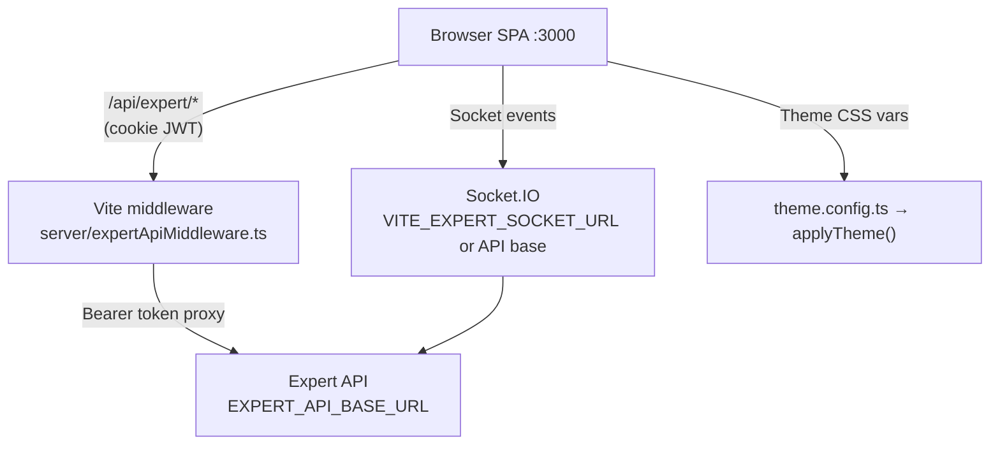
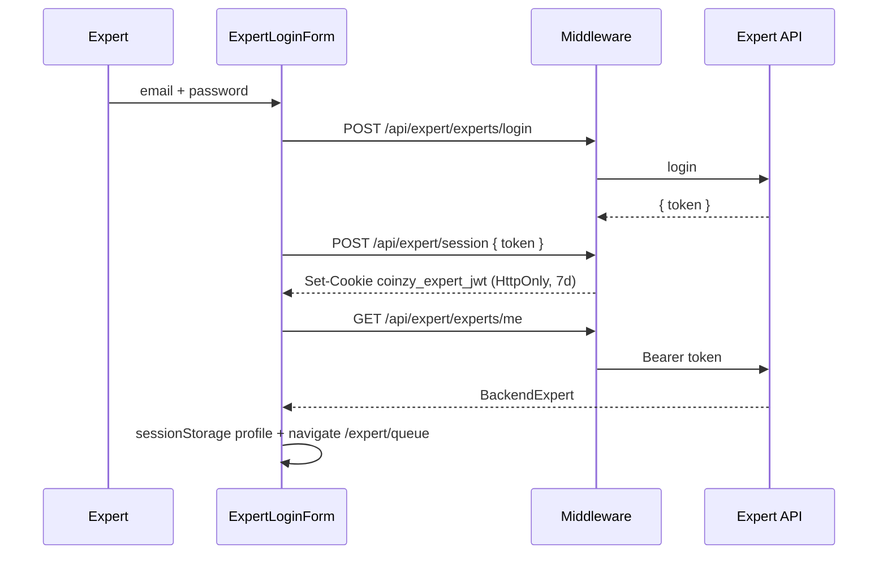
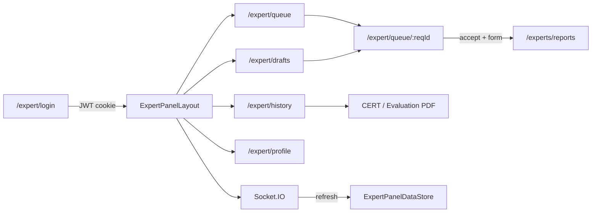

# Coinzy Expert Webapp — Full Guide

This document covers the **Vite + React** expert panel end to end: tech stack, folder layout, every product flow, edge cases / test cases, how to spin up a new branded app by changing a few things, and what to update when backend models change.

> This is **not** a Next.js app. Prefer Vite + React Router patterns (`AGENTS.md`).

---

## Table of contents

1. [Tech stack](#1-tech-stack)
2. [Architecture overview](#2-architecture-overview)
3. [Folder structure](#3-folder-structure)
4. [Setup & scripts](#4-setup--scripts)
5. [Environment variables](#5-environment-variables)
6. [Product flows](#6-product-flows)
7. [Realtime (Socket.IO)](#7-realtime-socketio)
8. [API layer](#8-api-layer)
9. [Data models](#9-data-models)
10. [Theme & white-label (new app in minutes)](#10-theme--white-label-new-app-in-minutes)
11. [When models / API change](#11-when-models--api-change)
12. [Edge cases](#12-edge-cases)
13. [Test cases](#13-test-cases)
14. [Deploy notes](#14-deploy-notes)

---

## 1. Tech stack

| Layer | Technology | Role |
| --- | --- | --- |
| Runtime | Node **≥ 20** | Dev server, middleware, build |
| Bundler | **Vite 7** | Dev HMR, production build → `dist/` |
| UI | **React 19** | Components / pages |
| Routing | **React Router 7** | SPA routes; thin Next-like adapters in `src/lib/router.tsx` |
| Styling | **Tailwind CSS 4** + CSS variables | Design tokens → utility classes |
| Theme | `src/config/theme.config.ts` | Single rebrand file (colors, buttons, icons, brand) |
| Auth session | HttpOnly cookie via Vite middleware | JWT never exposed to JS |
| API proxy | `server/expertApiMiddleware.ts` | `/api/expert/*` → backend |
| Realtime | **socket.io-client 4** | Offer / withdraw / accept / deadline events |
| PDF / capture | **jspdf** + **html-to-image** | Evaluation report PDF |
| CERT export | HTML download / print (`certReport.ts`) | History report modal |
| Tests | **Vitest** + **jsdom** | Unit tests under `src/lib/expert/__tests__/` |
| Deploy config | `netlify.toml` | Static SPA publish (API needs Node proxy) |

**Path alias:** `@` → `src/` (`vite.config.ts`).

---

## 2. Architecture overview



**Request path**

1. UI calls same-origin `/api/expert/...` (`apiClient.ts`).
2. Middleware reads HttpOnly cookie `coinzy_expert_jwt`, attaches `Authorization: Bearer …`, proxies to backend.
3. Panel data is normalized in mappers (`requestMappers.ts`, `profileService.ts`) into UI types (`types.ts`).
4. Socket events trigger silent refreshes; REST remains source of truth.

---

## 3. Folder structure

```
coinzy-expert-webapp-next-vite/
├── index.html
├── vite.config.ts              # React plugin, @ alias, API middleware
├── vitest.config.mts
├── netlify.toml
├── .env.example
├── public/                     # logo, nav icons, empty-state art, favicon
├── server/
│   └── expertApiMiddleware.ts  # session cookie, proxy, media, countries
├── scripts/                    # seed panel, generate JWT helpers
├── docs/
│   └── WEBAPP_GUIDE.md         # this file
└── src/
    ├── main.tsx                # applyTheme() + BrowserRouter
    ├── App.tsx                 # lazy routes
    ├── config/                 # ★ WHITE-LABEL: theme, buttons
    │   ├── theme.config.ts
    │   ├── applyTheme.ts
    │   ├── buttonStyles.ts
    │   └── index.ts
    ├── styles/                 # colors.css fallbacks + globals.css @theme
    ├── pages/                  # route entry pages
    ├── components/
    │   ├── auth/               # Login UI, Logo, PrimaryButton, …
    │   └── expert/             # Panel chrome, tables, evaluation, modals
    └── lib/
        ├── router.tsx          # Link / useRouter adapters
        ├── theme.ts            # TS color mirror for PDF/canvas
        └── expert/             # API, types, socket, reports, tests
```

---

## 4. Setup & scripts

```bash
cd coinzy-expert-webapp-next-vite
cp .env.example .env.local   # set EXPERT_API_BASE_URL
npm install
npm run dev                  # http://localhost:3000
```

| Script | What it does |
| --- | --- |
| `npm run dev` | Vite + API middleware on port **3000** |
| `npm run build` | `tsc --noEmit` + production build → `dist/` |
| `npm run preview` / `start` | Serve `dist` **with** middleware |
| `npm run lint` | Typecheck only |
| `npm test` | Vitest once |
| `npm run test:watch` | Vitest watch |
| `npm run seed:expert-panel` | Live seed helper (`ADMIN_API_KEY`) |
| `npm run generate:mobile-jwt` | JWT helper for scripts |

---

## 5. Environment variables

| Variable | Used by | Required |
| --- | --- | --- |
| `EXPERT_API_BASE_URL` | Middleware proxy + `/api/expert/socket-config` | **Yes** for real API |
| `VITE_EXPERT_API_BASE_URL` | Optional browser / build override; middleware fallback | Optional |
| `VITE_EXPERT_SOCKET_URL` | Socket.IO URL override | Optional |
| `ADMIN_API_KEY` | Seed script only | Scripts |
| `USER_JWT_SHARED_SECRET` | JWT script only | Scripts |

Default backend if unset: `http://localhost:3001`.

---

## 6. Product flows

### 6.1 Routes map

| Path | Page | Backend-wired? |
| --- | --- | --- |
| `/` → `/sign-in` → `/expert/login` | Redirects | — |
| `/expert/login` | Expert login | **Yes** |
| `/sign-up`, `/forgot-password`, `/check-email`, `/verification-code`, `/create-password` | Auth marketing UI | **Stubs** (not live API) |
| `/expert/queue` | Queue list | Yes |
| `/expert/queue/:reqId` | Request detail + evaluation | Yes |
| `/expert/drafts` | In-progress drafts | Yes |
| `/expert/history` | Completed / missed history | Yes |
| `/expert/profile` | Profile + reviews | Yes |

Panel routes (except login) wrap: **providers → `ExpertAuthGuard` → `ExpertPanelShell`**.

---

### 6.2 Login & session



**Guards**

- `ExpertLoginGate` — logged-in users skip login → queue.
- `ExpertAuthGuard` — panel requires valid session + profile store.
- API **401** → clear cookie, hard redirect to `/expert/login`.
- API **403** “not active” → account-disabled banner + forced logout.

**Storage**

| Store | Key | Purpose |
| --- | --- | --- |
| Cookie (HttpOnly) | `coinzy_expert_jwt` | Auth for proxy |
| sessionStorage | `coinzy_expert_profile` | Cached profile |
| sessionStorage | `coinzy_expert_account_disabled` | Disabled banner |
| sessionStorage | `coinzy_expert_login_success` | Welcome toast |
| sessionStorage | `coinzy.expert.showEvaluationDueSoonPrompt` | Due-soon modal once |
| localStorage | `coinzy_eval_draft_*` / report ids | Form draft backup |
| localStorage | expired-request notify store | Deadline toast dedupe |

---

### 6.3 Queue

1. `ExpertPanelDataProvider` loads offers + requests.
2. Mappers build **New requests** + **In progress** lists (`QueueListItem`).
3. Expert can **View / Accept** or **Skip** (confirm).
4. Pagination: `QUEUE_PAGE_SIZE` (5).
5. Socket `request.offered` / polling every **30s** when socket down refresh offers.
6. Clicking a row → `/expert/queue/:reqId`.

---

### 6.4 Request detail & evaluation

1. **Pre-accept:** review media → `POST …/offers/:id/accept`.
2. **Post-accept:** evaluation form (`EVALUATION_FORM_SECTIONS` → `ReportContentFields`).
3. **Save draft:** `POST/PUT /experts/reports` with `isDraft: true` (+ localStorage backup; autosave on tab hide).
4. **Submit:** validation on required fields → confirm modal → `isDraft: false`.
5. Leave-without-saving, deadline-exceeded, and media lightbox modals apply as needed.
6. Full-bleed layout: sidebar hidden on detail for focus.

**Offer error mapping:** workload limit, expired, already taken → user-facing copy via `formatOfferErrorMessage`.

---

### 6.5 Drafts

- Accepted requests with in-progress reports.
- Progress % derived from filled form fields.
- **Continue** → same request detail route.

---

### 6.6 History

- Rows from all requests (drafts excluded); period filter query `period`.
- Status pills: draft / new / completed / missed.
- Actions: resume, evaluate, view report, view details.
- Deep links: `?report=` / `?reportRequest=` open report modal.
- Exports:
  - **Evaluation PDF** — canvas capture + jsPDF pagination.
  - **CERT** — HTML download / print-to-PDF.

---

### 6.7 Profile

- `GET /experts/me` + reviews + countries (`/api/countries`).
- Availability toggle → `PUT /experts/me/availability` (turning **off** requires confirm).
- Edit profile → `PATCH /experts/me` (backend may return **501** → local-only messaging).
- On load while unavailable → prompt to turn availability back on.

---

### 6.8 Logout

Confirm modal → disconnect socket → `DELETE /api/expert/session` → clear profile → `/expert/login`.

---

## 7. Realtime (Socket.IO)

| Event | UI effect |
| --- | --- |
| `request.offered` | Silent refresh offers + toast (deduped ~60s per offer) |
| `request.withdrawn` | Silent refresh offers |
| `request.accepted` | Silent refresh all panel data |
| `request.deadline_missed` | Refresh requests + notify deadline listeners |

- Connect with `auth: { expertId }` after profile is ready.
- URL resolution: `VITE_EXPERT_SOCKET_URL` → else `VITE_EXPERT_API_BASE_URL` → else `GET /api/expert/socket-config`.
- Fallback: HTTP poll offers every 30s when not connected (skips while `document.hidden`).
- Logout disconnects the singleton client.

---

## 8. API layer

### Middleware routes

| Path | Behavior |
| --- | --- |
| `GET/POST/DELETE /api/expert/session` | Check / set / clear JWT cookie |
| `GET /api/expert/socket-config` | `{ url }` for Socket.IO |
| `GET /api/expert/media?url=` | Auth + SSRF-safe media fetch |
| `/api/expert/*` | Proxy to `EXPERT_API_BASE_URL` |
| `GET /api/countries` | Country list helper |

### Client services (`src/lib/expert/`)

| File | Responsibility |
| --- | --- |
| `apiClient.ts` | Envelope `{ error, message, data }`, 401/403 handling |
| `authService.ts` | Login + clear session |
| `profileService.ts` | Me / availability / normalize profile |
| `requestsService.ts` | Offers + requests lists |
| `offersService.ts` | Accept / skip |
| `reportsService.ts` | Create / update / get reports |
| `reviewsService.ts` | Expert reviews |
| `countriesService.ts` | Countries list |

---

## 9. Data models

Canonical types: **`src/lib/expert/types.ts`**.

### Layering

```
Backend* types  →  normalize/map  →  UI types (ExpertProfile, QueueListItem, …)
```

Always prefer updating **backend types + mappers** together when the API changes.

### Key types (summary)

| Type | Source | Used for |
| --- | --- | --- |
| `BackendExpert` | `GET /experts/me` | Raw API shape |
| `ExpertProfile` | Normalized | Shell, profile, availability |
| `BackendOffer` / `BackendRequest` | Offers / requests APIs | Queue building |
| `QueueListItem` | Mapper | Queue table |
| `DraftListItem` | Mapper | Drafts table |
| `HistoryRow` | Mapper | History table |
| `BackendReport` | Reports API | Drafts / submit / PDF |
| `ReportContentFields` | Nested report body | Evaluation form ↔ API |
| `EvaluationFormState` | Flat `Record<string, string>` | Controlled form inputs |
| `EvaluationRequestDetail` | Mapper | Detail page |
| `RequestMediaItem` | Mapper | Gallery / lightbox |

### Report content shape

```
ReportContentFields
├── generalInfo        (coinName, issuer, year, …)
├── physicalSpecs      (material, weight, …)
├── designDetails      (obverse, reverse, history)
├── valueAndRarity     (rarity, currency, price range)
└── expertAssessment   (authenticity, grade, recommendation)
```

Form sections live in `evaluationForm.ts` and must stay aligned with these nested keys.

---

## 10. Theme & white-label (new app in minutes)

### Why this is easy

Branding, colors, button sizes, and icons are centralized in **one file**:

**`src/config/theme.config.ts`**

At startup, `applyTheme()` (`main.tsx`) writes CSS variables. Tailwind classes (`bg-primary`, `bg-secondary`, `bg-expert-sidebar`, …) and shared buttons (`getButtonClass` / `PrimaryButton`) consume those variables. Logo, sidebar, and evaluation report brand strings also read the same config.

### How to create a new branded app

1. **Clone / copy** this project.
2. Edit **`src/config/theme.config.ts` only** for look & feel:
   - `brand.name`, `brand.appTitle`, `brand.logoSrc`, `brand.reportName`, portal labels
   - `colors.primary*` / `colors.secondary*` (+ expert panel tokens if needed)
   - `buttons.sizes` / `buttons.variants`
   - `icons.nav` / `icons.logo`
3. Replace assets under **`public/`** (logo, queue nav icon, empty-state / warning PNGs, favicon).
4. Point **`.env.local`** → your Expert API (`EXPERT_API_BASE_URL`).
5. Optionally rename package / `index.html` title (title is also set from `brand.appTitle` at runtime).
6. `npm install && npm run dev`.

### Minimal change checklist (new product skin)

| Change | File / place |
| --- | --- |
| Primary / secondary color | `theme.config.ts` → `colors` |
| Button height / radius | `theme.config.ts` → `buttons.sizes` |
| Logo + product name | `theme.config.ts` → `brand` + `public/*` |
| Nav icon size / queue PNG | `theme.config.ts` → `icons` + `public/` |
| API host | `.env.local` |
| Report brand string | `brand.reportName` (already wired) |

You do **not** need to hunt through pages for hex codes for primary CTAs, sidebar, or shared buttons.

### Using buttons in code

```ts
import { getButtonClass, PrimaryButton } from "@/config";
// or from @/components/auth/PrimaryButton

<PrimaryButton variant="primary" size="lg">Sign in</PrimaryButton>
<PrimaryButton variant="secondary" size="md">Secondary</PrimaryButton>

<button className={getButtonClass({ variant: "outline", size: "sm" })}>
  Outline
</button>
```

---

## 11. When models / API change

Use this playbook so the UI stays correct without scattershot edits.

### A. Field renamed or added on expert / request / report

1. Update **`Backend*`** type in `src/lib/expert/types.ts`.
2. Update the **mapper / normalizer**:
   - Profile → `profileService.ts` (`normalizeExpertProfile`)
   - Queue / drafts / history / detail → `requestMappers.ts`
   - Report form ↔ API → `evaluationForm.ts`, `reportContentFields.ts`, `reportsService.ts`
3. Update **UI types** (`ExpertProfile`, `QueueListItem`, …) if the screen needs the new field.
4. Update **components** that display or edit the field.
5. Add / adjust a **unit test** under `src/lib/expert/__tests__/`.

### B. Evaluation form fields change

1. Change section/field defs in **`evaluationForm.ts`** (`EVALUATION_FORM_SECTIONS`).
2. Align nested **`ReportContentFields`** in `types.ts`.
3. Align serializers in **`reportContentFields.ts`** / report view builders.
4. Update validation tests in **`evaluationFormValidation.test.ts`**.
5. If PDF layout shows the field, update **`evaluationReportView.ts`** / layout tokens.

### C. New request status or offer state

1. Extend `RequestStatus` / offer handling in `types.ts`.
2. Teach **`requestMappers.ts`** how it appears in queue / history / drafts.
3. Update row styles in **`queueRowStyles.ts`** if a new visual variant is needed.
4. Cover with **`requestMappers.test.ts`**.

### D. Auth / session contract changes

1. Middleware cookie / login paths: **`server/expertApiMiddleware.ts`**.
2. Client: **`authService.ts`**, **`apiClient.ts`**, gates (`ExpertAuthGuard`, `ExpertLoginGate`).

### E. Socket payload changes

1. Types: `src/lib/expert/socket/types.ts`.
2. Handlers: socket provider / listeners (refresh still preferred over trusting payload alone).

### F. Branding-only (no model change)

Only touch **`src/config/theme.config.ts`** + `public/` assets — see [§10](#10-theme--white-label-new-app-in-minutes).

### Quick “where do I edit?” map

| If this changes… | Start here |
| --- | --- |
| Colors / buttons / logo | `src/config/theme.config.ts` |
| Expert profile JSON | `types.ts` → `profileService.ts` → profile UI |
| Offer / request JSON | `types.ts` → `requestMappers.ts` → queue/drafts/history |
| Report JSON / form | `types.ts` → `evaluationForm.ts` + `reportsService.ts` |
| PDF look | `evaluationReportTokens.ts` + `evaluationReportExport.ts` (primary follows theme) |
| Proxy / cookie | `server/expertApiMiddleware.ts` |
| Routes | `src/App.tsx` + `src/pages/` |

---

## 12. Edge cases

| Scenario | Expected behavior |
| --- | --- |
| Deadline expired | Row flagged; detail blocks submit; modal / toast; socket `deadline_missed` refreshes |
| Empty queue / drafts / history | `ExpertEmptyState` + illustrations |
| Media URL remote | Fetched via `/api/expert/media` (auth + private-IP block) |
| Media / API upstream down | Middleware **502**; client shows generic failure |
| Offline / network fail | `apiClient` status `0` + generic message |
| Session expired (401) | Cookie cleared → redirect login |
| Account inactive (403) | Disabled banner + forced logout |
| Offer expired / taken / workload | Mapped error messages; may mark unavailable |
| Draft report id lost | localStorage backup + 409 create recovery + lookup by request |
| Profile PATCH 501 | “Not implemented” / local-save messaging |
| Socket disconnected | 30s offer polling; no poll while tab hidden |
| Unavailable on refresh | One-time availability prompt |
| React Strict Mode | Socket handlers re-attach without killing connection |
| Auth stub pages | Signup / forgot / verify are **UI only** — do not treat as live |
| Static Netlify only | SPA routes work; **session/proxy/media need Node middleware** |

---

## 13. Test cases

### Automated (Vitest) — already in repo

Run: `npm test`

| Area | File | Covers |
| --- | --- | --- |
| Profile mapping | `profileService.test.ts` | `yearsOfXp`, normalize, full name |
| Queue / drafts mappers | `requestMappers.test.ts` | Deadlines, lists, video posters |
| Form validation | `evaluationFormValidation.test.ts` | Required fields before submit |
| Deadline modal | `deadlineExceededModal.test.ts` | When modal should open |
| Deadline toast | `deadlineExceededToast.test.ts` | Copy / legacy message |
| Expired notifications | `expiredRequestNotifications.test.ts` | Format, collect, localStore, service |
| PDF pagination | `evaluationReportPdfPagination.test.ts` | Page-split helpers |
| Format helpers | `format.test.ts` | Deadlines, labels, displayId |

### Manual / QA checklist (flows)

**Auth**

- [ ] Valid login → lands on queue; cookie set; profile loaded
- [ ] Wrong password → inline error
- [ ] Inactive account → disabled messaging
- [ ] Already logged in visiting `/expert/login` → redirect queue
- [ ] 401 mid-session → redirect login
- [ ] Logout confirm → session cleared → login page

**Queue**

- [ ] Empty state when no offers/requests
- [ ] New offer appears (socket or poll)
- [ ] Skip offer with confirm; toast
- [ ] Accept → detail; reject / expired offer errors
- [ ] Pagination when > page size

**Evaluation**

- [ ] Required fields block submit
- [ ] Save draft persists after refresh
- [ ] Autosave on tab hide
- [ ] Leave with unsaved changes → confirm
- [ ] Submit success → history / completed path
- [ ] Deadline exceeded → cannot submit; modal shown
- [ ] Media lightbox open/close; broken media graceful fail

**Drafts / History**

- [ ] Continue draft resumes same request
- [ ] Period filters change rows
- [ ] View report modal; PDF download; CERT HTML/print
- [ ] Deep link `?report=` opens report

**Profile**

- [ ] Toggle availability off → confirm; on → no confirm
- [ ] Unavailable prompt on load
- [ ] Edit fields + save (or 501 messaging)
- [ ] Reviews list / empty reviews

**Theme / rebrand smoke**

- [ ] Change `primary` / `secondary` in theme config → CTAs & accents update
- [ ] Change `brand.name` / `logoSrc` → login, sidebar, report header
- [ ] Change `buttons.sizes.lg.radius` → auth button shape changes

**Regression when models change**

- [ ] Unit tests for mapper/normalizer updated and green
- [ ] Queue / drafts / history still render with sample payload
- [ ] Submit report still matches new `contentFields` shape
- [ ] PDF still generates without blank required sections

---

## 14. Deploy notes

```bash
npm run build     # → dist/
npm run preview   # local prod smoke WITH middleware
```

**Netlify (`netlify.toml`):** publishes `dist` with SPA fallback. That is enough for static UI routes, but **authenticated `/api/expert/*`, session cookies, media proxy, and countries** require the Vite middleware (or an equivalent Node/Edge proxy in front of the Expert API).

Production checklist:

1. Set `EXPERT_API_BASE_URL` (and optional `VITE_EXPERT_SOCKET_URL`) on the host that runs middleware.
2. Ensure cookie `Secure` in production (`NODE_ENV=production`).
3. Confirm Socket.IO CORS / origin allows the webapp host.
4. Re-test login → queue → accept → draft → submit → PDF after deploy.

---

## Appendix A — Flow map (all main screens)



---

## Appendix B — File cheat sheet

| Need | Path |
| --- | --- |
| Rebrand colors / buttons / icons | `src/config/theme.config.ts` |
| Apply theme | `src/config/applyTheme.ts`, `src/main.tsx` |
| Routes | `src/App.tsx` |
| API proxy / session | `server/expertApiMiddleware.ts` |
| Types | `src/lib/expert/types.ts` |
| Queue mapping | `src/lib/expert/requestMappers.ts` |
| Evaluation form | `src/lib/expert/evaluationForm.ts` |
| Socket | `src/lib/expert/socket/` |
| PDF export | `src/lib/expert/evaluationReportExport.ts` |
| Unit tests | `src/lib/expert/__tests__/` |

---

*Last updated for the Vite expert panel white-label theme system (`src/config/`).*
